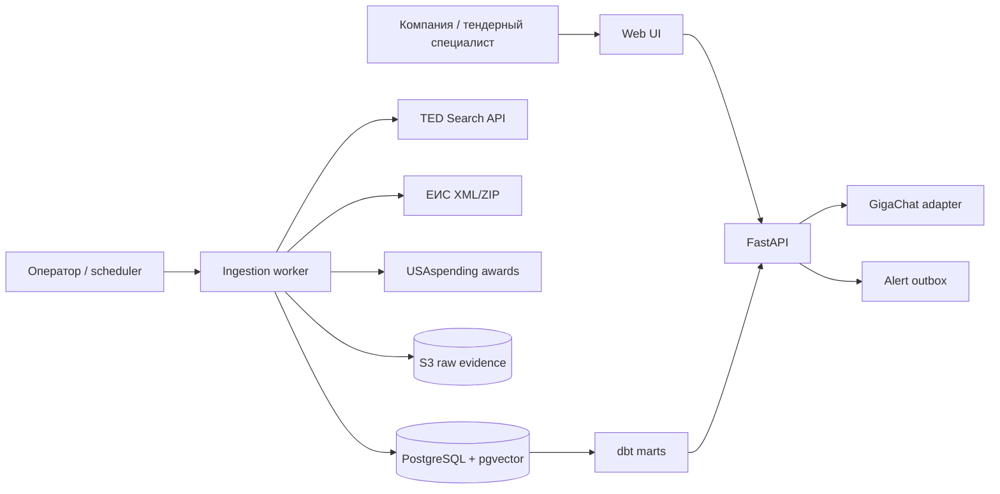

# Архитектура

## Контекст

TenderPulse запускается одним Docker Compose project. Web/API принимает профиль и управляемые
ingestion-запросы. Worker обращается только к allowlisted source adapters, сохраняет исходный ответ
в S3-compatible object storage и одной транзакцией регистрирует hash/run. Нормализатор пишет
canonical сущности и SCD2-версии в PostgreSQL; dbt строит проверяемые marts. Matcher использует
структурированные признаки и при наличии конфигурации GigaChat добавляет строго валидированное
извлечение требований/объяснение. Ни LLM, ни web UI не владеют canonical facts.

## Инварианты

- Raw payload после регистрации не изменяется; identity — `sha256(content)` и source locator.
- Canonical record не существует без `source`, `source_record_id`, `ingestion_run_id` и raw evidence.
- Один и тот же content hash идемпотентен; изменение значимых полей закрывает предыдущую SCD2-версию.
- `source_published_at`, `observed_at` и `ingested_at` — разные поля и не подменяют друг друга.
- Unknown сохраняется явно. Парсер не угадывает валюту, deadline, winner или crosswalk классификатора.
- Запуск по умолчанию ≤100 records/source, hard limit ≤500; полная выгрузка требует нового решения.
- LLM не создаёт facts: его claims имеют prompt/model/input hash, citations и validation status.
- Все внешние URL зафиксированы adapter config; пользователь не может превратить ingestion в SSRF.
- TLS verification не отключается, секреты не логируются и не попадают в raw artifacts.
- Код, schema, OpenAPI, docs, fixtures, tests и marts изменяются как одна projection группы понятий.

### IMMUNE как архитектурное ограничение

- **Intent before implementation:** acceptance/eval появляется раньше production-кода.
- **Mutations preserve coherence:** migration + adapter + API + docs + tests являются одним изменением.
- **Meta over patch:** повторяемые source quirks решает declarative mapping/contract, а не цепочка исключений.
- **Unexpected states fail loud:** job получает terminal `failed` с typed reason; partial success перечисляет gaps.
- **No duplicated authority:** canonical model и source registry — SSOT, UI/dbt являются проекциями.
- **Every state is explainable:** run, raw hash, version diff, evidence, model invocation и alert delivery связаны IDs.

## Компоненты и границы

| Компонент | Владеет | Не владеет | Отказ |
| --- | --- | --- | --- |
| Source adapter | request bounds, raw response contract | canonical rules | typed source error, no silent empty success |
| Raw store | immutable bytes + metadata | interpretation | run fails before canonical write |
| Normalizer | source → canonical mapping | ranking | rejected record + explicit validation issue |
| PostgreSQL | entities, SCD2, jobs, evidence, outbox | raw bytes | health degraded, transaction rolls back |
| dbt | analytics projections/tests | source facts | mart build fails loudly |
| Matcher | deterministic score components | source parsing | returns unknown/gaps with evidence |
| GigaChat adapter | OAuth cache, structured extraction | canonical truth | retryable/permanent error, deterministic fallback |
| API/Web | commands and projections | background execution | 4xx input, 409 state, 502 dependency |
| Alert dispatcher | idempotent delivery attempts | recommendation score | outbox retained with reason/retry state |

## Основной flow

```mermaid
flowchart LR
  Filter["Профиль + bounded filter"] --> Fetch["Source adapter"]
  Fetch --> Hash["Raw bytes + SHA-256"] --> Validate["Contract validation"]
  Validate --> Normalize["Canonical mapping"] --> Version["SCD2 compare/write"]
  Version --> Match["Deterministic features"] --> Extract["Optional GigaChat evidence"]
  Extract --> Recommend["Score + reasons + gaps + provenance"]
  Recommend --> Outbox["Idempotent alert outbox"]
```

## Latency, capacity и failure paths

- Регулярный ingestion выполняет worker. Явный bounded manual trigger в локальном MVP ждёт завершения
  одного запроса; его run status/raw hash остаются в БД. Перед публичным deployment нужен durable queue.
- Foundation рассчитан на 2 профиля и сотни, не миллионы, records. Порог пересмотра указан в ADR-001.
- HTTP source timeout — 30 секунд на запрос; повтор возможен только для idempotent read с bounded backoff.
- `0 records` допустим только вместе с подтверждённым успешным source response и параметрами запроса.
- Partial record не удаляется, но его validation issues и недоступные поля видны downstream.
- Alert dispatcher MVP — идемпотентный канал `in_app`; email/webhook destinations пока не определены.

## Значимые решения

- [ADR-001: platform and data boundaries](decisions/ADR-001-platform-and-data-boundaries.md).
