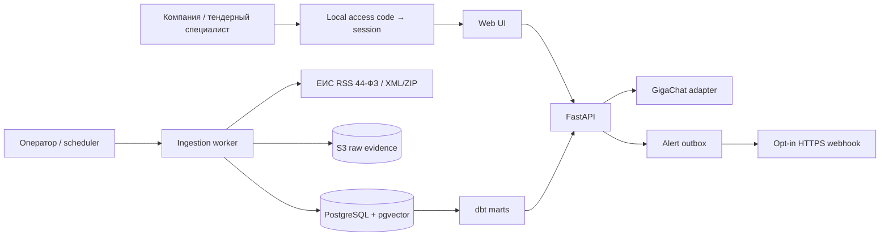

# Архитектура

## Контекст

TenderPulse запускается одним Docker Compose project. В MVP 2.1 Web/API начинает запрос с local
account session и разрешённого company profile, а не с query selector. Web/API управляет versioned-профилем
и bounded ЕИС-загрузкой. Каждый цикл перечитывает account-visible profile versions из PostgreSQL и сохраняет
их номера в ingestion run, но число demo-профилей не является runtime-limit. Worker обращается только
к официальному ЕИС RSS, сохраняет bytes в S3-compatible raw store и регистрирует SHA/run; XML/ZIP
остаётся bounded manual fallback. Нормализатор пишет canonical JSON и SCD2-версии в PostgreSQL, dbt
строит только российскую current projection. Matcher объединяет классификаторы, текст, бюджет и typed
географию; optional GigaChat извлекает требования только из сохранённой record version. Ни LLM, ни UI
не владеют canonical facts.

## Инварианты

- Raw payload после регистрации не изменяется; identity — `sha256(content)` и source locator.
- Canonical record не существует без `source`, `source_record_id`, `ingestion_run_id` и raw evidence.
- Один и тот же content hash идемпотентен; изменение значимых полей закрывает предыдущую SCD2-версию.
- Новый raw response с тем же canonical fingerprint создаёт auditable run/raw, но не перепривязывает
  существующую record version или organization links к новому SHA.
- `source_published_at`, `observed_at` и `ingested_at` — разные поля и не подменяют друг друга.
- Unknown сохраняется явно. Парсер не угадывает валюту, deadline, winner или crosswalk классификатора.
- Organization identity source-scoped: точное нормализованное имя переиспользуется внутри source, но
  межисточниковый merge требует отдельного устойчивого identifier/evidence.
- Live-запуск по умолчанию ≤25 records и всегда ≤50; ЕИС-окно ≤31 дня, body ≤2 MiB. Значение выше
  source contract отклоняется, а не молча обрезается. Полная выгрузка требует нового решения.
- LLM не создаёт facts: его claims имеют prompt/model/input hash, citations и validation status.
- Company profile изменяется только добавлением следующей immutable version; bootstrap добавляет
  отсутствующие demo-профили, но никогда не реактивирует seed поверх пользовательской версии.
- Account binding, а не `company_profiles.active`, владеет tenant visibility. `active` продолжает
  означать ровно current profile version; legacy history не удаляется при смене рабочего каталога.
- Authenticated company request получает один profile slug из server-side session. Чужой slug никогда
  не вызывает fallback к первому профилю; navigation visibility не заменяет API authorization.
- Procurement raw/canonical/history shared между accounts. Profile history, recommendation, analytics,
  AI action и alert доступны только в account-authorized profile context.
- Runtime source scope читает те же current DB profiles, что matcher/alerts; `load_demo_profiles` допустим
  только для bootstrap/fixtures. Неожиданное число или дубликаты active profiles останавливают fetch.
- `source_policy.current_product_records` владеет российской current projection: `source=eis` и `RU`.
  `current_opportunities` дополняет её `kind=notice`, `lifecycle=active|planned`; API, UI, analytics,
  dbt и alerts не скрывают foreign records собственными эвристиками.
- `domain.geography` — один typed owner ISO `RU-*`, delivery mode и reach assessment. Matcher может
  вернуть geography reason, risk (`review`) или blocker (`not_relevant`); unknown не становится match.
- `CompanyProfile.min_amount/max_amount` задают eligibility boundary: если все lot amounts известны и
  ни один не попадает в диапазон, matcher возвращает typed budget blocker. Если при заданной границе
  сумма полностью или частично unknown и нет доказанного подходящего lot, решение не выше `review`.
  Неизвестная сумма не подменяется нулём; mixed lots допускают участие, если хотя бы один lot подходит.
- `CompanyProfile.review_above_amount` — generic business threshold для неизвестной квалификации. Если
  все подходящие по бюджету lots выше порога, matcher добавляет `qualification_review_required` и не
  поднимает решение выше `review`. Владелец правила — typed profile field; matcher не распознаёт право
  из свободного текста и не объявляет наличие лицензии/опыта.
- Явное совпадение многословной service phrase даёт `0.30` тематического evidence и может поднять
  sparse RSS record до `review`; одиночный stem сохраняет вес `0.10`. Это не рекомендация: budget,
  geography, deadline и qualification gates продолжают ограничивать итоговое решение.
- Тендерная страница читает последний extraction attempt только для текущей record version. Payload migration
  добавляет явный coverage status старым attempts, не превращая отсутствие evidence в `not_present`.
- `ProductAnalytics` — единая typed projection для API и страницы аналитики. Decision/coverage/distribution
  показатели читают current active/planned notices; history читает все SCD2 versions; outcomes — current
  award lots. `nearest_deadlines` содержит только `recommended|review`, чтобы rejected audit не становился
  рабочим календарём. UI обязан показывать scope labels и не называть projection вероятностью победы.
- Все внешние URL зафиксированы adapter config; пользователь не может превратить ingestion в SSRF.
- TLS verification не отключается, секреты не логируются и не попадают в raw artifacts.
- Код, schema, OpenAPI, docs, fixtures, tests и marts изменяются как одна projection группы понятий.
- Pilot evaluation разделяет immutable public-fact sample, blind labels и matcher snapshot. Label artifact
  не содержит decision/score/reasons; evaluator принимает их отдельными inputs, проверяет одинаковый
  record universe/profile version и fail-loud на duplicate или missing lineage. Нулевой denominator
  остаётся явным `null`, поэтому evaluator не выдумывает 0% или 100% precision/recall.
  Sample может агрегировать минимальный набор bounded ЕИС requests; каждый request отдельно соблюдает
  source limits, а artifact сохраняет membership и параметры каждого capture вместо скрытого pagination.

### IMMUNE как архитектурное ограничение

- **Intent before implementation:** acceptance/eval появляется раньше production-кода.
- **Mutations preserve coherence:** migration + adapter + API + docs + tests являются одним изменением.
- **Meta over patch:** повторяемые source quirks решает declarative mapping/contract, а не цепочка исключений.
- **Unexpected states fail loud:** job получает terminal `failed` с typed reason; partial success перечисляет gaps.
- **No duplicated authority:** canonical model и source registry — SSOT, UI/dbt являются проекциями.
- **Every state is explainable:** run, raw hash, version diff, evidence, model invocation и alert delivery связаны IDs.

## Компоненты и границы

| Компонент | Владеет | Не владеет | Отказ |
| --- | --- | --- | --- |
| Source adapter | request bounds, raw response contract | canonical rules | typed source error, no silent empty success |
| Raw store | immutable bytes + metadata | interpretation | run fails before canonical write |
| Normalizer | source → canonical mapping | ranking | rejected record + explicit validation issue |
| PostgreSQL | entities, SCD2, jobs, evidence, outbox | raw bytes | health degraded, transaction rolls back |
| Auth/session | account identity, credential hash, session expiry/revocation, profile binding | procurement facts | generic 401/login, чужой profile fail-closed |
| dbt | analytics projections/tests | source facts | mart build fails loudly |
| Matcher | deterministic score components | source parsing | returns unknown/gaps with evidence |
| GigaChat adapter | OAuth cache, structured extraction | canonical truth | retryable/permanent error, deterministic fallback |
| API/Web | versioned profile commands, separated decision queue, product analytics and current evidence projections | background execution | 4xx input, 409 state, 502 dependency |
| Alert dispatcher | idempotent delivery attempts | recommendation score | outbox retained with reason/retry state |

## Web information architecture

Server-rendered FastAPI/Jinja остаётся технологическим владельцем UI: для этого MVP SPA не добавляет
ценности, но создаёт второй API/state owner. Общий layout владеет design tokens, account navigation,
authorized profile context, accessibility landmarks и responsive shell. Каждый page route владеет одной задачей:

| Маршрут | Основная задача | Не показывает |
| --- | --- | --- |
| `/` | краткий обзор и следующий шаг | редакторы, полную аналитику, ingestion forms |
| `/tenders` | поиск, фильтры, actionable/rejected queue | company editor, data loading |
| `/analytics` | профильные метрики и объяснимые scopes | tender cards и mutation forms |
| `/company` | редактирование своей компании и version history | чужие профили и ingestion |
| `/data` | operator-only freshness/run/upload/history | company navigation; company role получает 403 |
| `/login`, `/logout` | access-code session lifecycle | GigaChat key, registration и profile selector |

Page-context builders проецируют typed owners; шаблоны не пересчитывают matching, geography, auth или
analytics. Account binding сохраняет company context на всех маршрутах, tender filters существуют только
на `/tenders`, а invalid/cross-company context не исправляется скрытым fallback.

## Основной flow

```mermaid
flowchart LR
  Filter["Current DB profiles + bounded filter"] --> Fetch["Source adapter"]
  Fetch --> Hash["Raw bytes + SHA-256"] --> Validate["Contract validation"]
  Validate --> Normalize["Canonical mapping"] --> Version["SCD2 compare/write"]
  Version --> Match["Deterministic features"] --> Extract["Optional GigaChat evidence"]
  Extract --> Recommend["Score + reasons + gaps + provenance"]
  Recommend --> Outbox["Idempotent alert outbox"]
```

## Latency, capacity и failure paths

- Регулярный ingestion выполняет worker. Явный bounded manual trigger в локальном MVP ждёт завершения
  одного запроса; его run status/raw hash остаются в БД. Перед публичным deployment нужен durable queue.
- Foundation рассчитан на десятки active профилей и сотни, не миллионы, records. Порог пересмотра
  указан в ADR-001.
- HTTP source timeout — 30 секунд на запрос; повтор возможен только для idempotent read с bounded backoff.
- `0 records` допустим только вместе с подтверждённым успешным source response и параметрами запроса.
- ЕИС adapter принимает только RSS 2.0 с фиксированного HTTPS host, одной страницы 44-ФЗ и размера до
  2 MiB. Root + issuing CA проверяются локально; отключение TLS verification запрещено.
- Partial record не удаляется, но его validation issues и недоступные поля видны downstream.
- Alert dispatcher всегда создаёт идемпотентный `in_app` event. Опциональный HTTPS webhook отправляет
  тот же snapshot со стабильным `Idempotency-Key`; каждая попытка сохраняет только destination hash,
  HTTP status/error class и retry state, без URL и response body.

## Значимые решения

- [ADR-001: platform and data boundaries](decisions/ADR-001-platform-and-data-boundaries.md).
- [ADR-002: organization identity boundary](decisions/ADR-002-organization-identity-boundary.md).
- [ADR-003: official ЕИС RSS and TLS boundary](decisions/ADR-003-eis-rss-and-tls-boundary.md).
- [ADR-004: Russian source and geography boundary](decisions/ADR-004-russian-source-and-geography-boundary.md).
- [ADR-005: local account and tenant boundary](decisions/ADR-005-local-account-and-tenant-boundary.md).

<!-- immune-project-engineering:architecture:start -->
## Технологический выбор

Python 3.12/FastAPI/Jinja остаются page/API owner: текущие typed domain contracts, TestClient suite и
Docker runtime уже доказаны, а route-based UI не требует client framework. Vanilla CSS/JS владеют design
tokens, progressive interaction и responsive layout. CSS-only patch не разделяет задачи; SPA создаёт
второй toolchain/state owner без подтверждённой MVP-потребности.

## Docker-контур

Compose содержит `api`, `worker`, one-shot `init`, PostgreSQL/pgvector и MinIO. Один Python image
собирает API/worker/init; templates/static входят без отдельного frontend build. `init` идемпотентно
применяет Alembic и seed; DB/MinIO имеют volumes, API/worker — health checks и stdout logs. Секреты
приходят через `.env`, не входят в image/Git. Локально API опубликован на `127.0.0.1:8010`; production
deployment пока non-goal. Rollback — предыдущий image/commit без schema downgrade; UI migration не нужна.
<!-- immune-project-engineering:architecture:end -->
