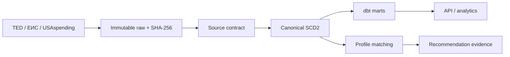

# Данные

## Сущности и владельцы

| Сущность | Назначение | Владелец | Идентификатор |
| --- | --- | --- | --- |
| Source | allowlisted contract/config | platform | stable code: `ted`, `eis`, `usaspending` |
| Ingestion run | параметры, cursor, counts, status/errors | worker | UUID |
| Raw artifact | неизменяемый source response | raw store | SHA-256 + object URI |
| Procurement record | общий lifecycle container | normalizer | UUID + source natural key |
| Notice version | SCD2-снимок notice | normalizer | record UUID + version number |
| Lot | предмет, CPV/OKPD2/PSC, сумма, deadline | normalizer | source lot ID or explicit synthetic key |
| Organization | source-scoped buyer/supplier identity | identity projection | UUID + source + normalized name |
| Organization alias | исходная форма имени | identity projection | UUID + organization + alias |
| Procurement organization link | роль/порядок и raw evidence конкретной SCD2-версии | identity projection | record version + role + ordinal |
| Award | результат, winner, amount, dates | normalizer | source award ID |
| Company profile | capabilities, codes, geography, constraints | company service | UUID + version |
| AI extraction attempt | validated/rejected/failed claims + model/prompt/hashes | extraction service | UUID + record version |
| Recommendation | score, decision, gaps and freshness | matcher | profile version + record version |
| Match evidence | feature, weight, value, citation | matcher | UUID |
| Alert event | idempotent in-app delivery snapshot | dispatcher | profile version + record version + channel + policy |
| Alert delivery attempt | webhook status/retry evidence without destination/response content | dispatcher | alert + destination hash + attempt |

## Lifecycle и версии

1. Adapter создаёт `ingestion_run`, фиксирует query/filter/limit/cursor и получает bytes.
2. Bytes записываются под content-addressed key; БД получает SHA-256, media type, source URL и timestamps.
3. Contract validator либо передаёт record нормализатору, либо сохраняет typed rejection. Пустой
   валидный RSS channel является успешным run с `0 records`; пустые bytes, битая/неожиданная schema — нет.
4. Natural key source-а связывается с procurement record. Равный canonical content hash ничего не
   меняет; новый hash закрывает `valid_to` предыдущей версии и открывает следующую.
5. `current` view выбирает открытую версию. Historical marts читают все версии и runs.
6. Recommendation привязана к точным версиям профиля/record и пересчитывается при изменении любой.
7. Raw и history в MVP не удаляются автоматически. Политика retention появится только с измеренным
   объёмом и recovery test.
8. GigaChat output не обновляет canonical record. Attempt связан с record version/raw SHA и принимает
   статус `validated` только после проверки schema, coverage status и verbatim citations.
9. In-app alert создаётся один раз на сочетание profile version, record version, channel и policy version;
   `read_at` меняет только состояние inbox, но не recommendation evidence.
10. Buyer/supplier alias создаёт source-scoped organization и immutable link к record version/raw SHA.
    Штатный `init-db` идемпотентно backfill-ит ссылки для уже существующей истории.
11. Webhook attempt использует стабильный idempotency key. `2xx` завершает delivery; transport/429/5xx
    допускают bounded retry, остальные `4xx` остаются terminal failed.

`source_published_at` принадлежит источнику, `observed_at` — момент видимости ответу adapter-а,
`ingested_at` — commit в TenderPulse. Freshness считается по всем трём и показывает unknown отдельно.

## Provenance и чувствительность

- TED/ЕИС/USAspending records — публичные данные, но их лицензия/source URL сохраняются рядом с artifact.
- Профиль компании может содержать коммерчески чувствительные сведения; он не отправляется внешней
  модели целиком и не попадает в telemetry/raw source storage.
- Raw artifact содержит только ответ allowlisted procurement source, не `.env` и не access token.
- GigaChat claim хранит model, prompt version, input hash, output hash, citations и validation result.
- CPV, ОКПД2 и PSC не считаются эквивалентными. Crosswalk — отдельный versioned evidence set; при его
  отсутствии используются независимые profile tags/keywords с явным меньшим confidence.
- Organization merge между source без устойчивого identifier не выполняется; совпадение имени остаётся
  только кандидатом для будущего evidence-backed resolution.

## Data flow

## Source semantics

| Source | Natural key | Active opportunity | Outcome/history | Known MVP risk |
| --- | --- | --- | --- | --- |
| TED | publication number + procedure/lot IDs | yes | result notices, sometimes incomplete winner | multilingual arrays and lot alignment |
| ЕИС | 19-digit registry number | yes, live RSS 44-ФЗ | bounded XML/ZIP protocols/contracts | RSS omits CPV/deadline; issuing CA and layouts can rotate |
| USAspending | generated award ID / PIID | no | yes | time filters apply to transactions, not notice lifecycle |
