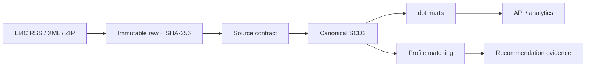

# Данные

## Сущности и владельцы

- `Account` владеет local identity, role/status и binding к одному company profile slug.
- `AccessCredential` хранит keyed hash access code; raw code существует только в local secret config
  и в момент выдачи пользователю.
- `WebSession` хранит opaque session hash, account, expiry/revocation и audit timestamps.
- Account binding определяет visibility, но не меняет source ownership: procurement facts остаются shared.

| Сущность | Назначение | Владелец | Идентификатор |
| --- | --- | --- | --- |
| Source | allowlisted contract/config | platform | current: `eis`; `ted`/`usaspending` legacy |
| Ingestion run | параметры, cursor, counts, status/errors | worker | UUID |
| Raw artifact | неизменяемый source response | raw store | SHA-256 + object URI |
| Procurement record | общий lifecycle container | normalizer | UUID + source natural key |
| Notice version | SCD2-снимок notice | normalizer | record UUID + version number |
| Lot | предмет, CPV/OKPD2/PSC, сумма, deadline | normalizer | source lot ID or explicit synthetic key |
| Organization | source-scoped buyer/supplier identity | identity projection | UUID + source + normalized name |
| Organization alias | исходная форма имени | identity projection | UUID + organization + alias |
| Procurement organization link | роль/порядок и raw evidence конкретной SCD2-версии | identity projection | record version + role + ordinal |
| Award | результат, winner, amount, dates | normalizer | source award ID |
| Company profile | capabilities, codes, geography, constraints | company service | UUID + version |
| AI extraction attempt | validated/rejected/failed claims + model/prompt/hashes | extraction service | UUID + record version |
| Recommendation | score, decision, gaps and freshness | matcher | profile version + record version |
| Match evidence | feature, weight, value, citation | matcher | UUID |
| Product analytics | typed current/history/outcome projection | analytics service | profile slug + current snapshot |
| Alert event | idempotent in-app delivery snapshot | dispatcher | profile version + record version + channel + policy |
| Alert delivery attempt | webhook status/retry evidence without destination/response content | dispatcher | alert + destination hash + attempt |
| Pilot sample item | bounded public notice facts + lineage, без raw bytes | eval capture | source + source record ID + canonical version |
| Blind pilot label | provisional agent judgement/reason/confidence, без matcher fields | eval labeler | sample ID + rubric version |
| Pilot prediction | frozen matcher decision/evidence references | eval runner | sample ID + profile version + policy version |
| Pilot report | scoped metrics/disagreements/review shortlist | eval evaluator | sample hash + labels hash + predictions hash |
| Imported human review | reviewer labels/text + exact frozen lineage, без canonical mutation | eval importer | document + packet + shortlist hashes |
| Human shortlist report | biased-scope comparison with pre-existing matcher snapshot | eval evaluator | human artifact + predictions + shortlist report hashes |
| Human review revision | ручная оценка exact source/profile state | human-review service | account + profile version + record version + revision |

## Lifecycle и версии

1. Adapter создаёт `ingestion_run`, фиксирует query/filter/limit/cursor и получает bytes.
2. Bytes записываются под content-addressed key; БД получает SHA-256, media type, source URL и timestamps.
3. Contract validator либо передаёт record нормализатору, либо сохраняет typed rejection. Пустой
   валидный RSS channel является успешным run с `0 records`; пустые bytes, битая/неожиданная schema — нет.
4. Natural key source-а связывается с procurement record. Равный canonical content hash ничего не
   меняет; новый hash закрывает `valid_to` предыдущей версии и открывает следующую.
   Если изменился только raw response envelope, но canonical fingerprint record-а равен, текущая версия
   и её organization links сохраняют исходный raw SHA; новый ingestion run/raw фиксирует replay отдельно.
5. `current` view выбирает открытую версию. Historical marts читают все версии и runs.
6. Recommendation привязана к точным версиям профиля/record и пересчитывается при изменении любой.
7. Raw и history в MVP не удаляются автоматически. Политика retention появится только с измеренным
   объёмом и recovery test.
8. GigaChat output не обновляет canonical record. Attempt связан с record version/raw SHA и принимает
   статус `validated` только после проверки schema, coverage status и verbatim citations.
9. In-app alert создаётся один раз на сочетание profile version, record version, channel и policy version;
   `read_at` меняет только состояние inbox, но не recommendation evidence.
10. Buyer/supplier alias создаёт source-scoped organization и immutable link к record version/raw SHA.
    Штатный `init-db` идемпотентно backfill-ит ссылки для уже существующей истории.
11. Webhook attempt использует стабильный idempotency key. `2xx` завершает delivery; transport/429/5xx
    допускают bounded retry, остальные `4xx` остаются terminal failed.
12. Profile PUT принимает только следующую версию, нормализует и дедуплицирует matching-поля, закрывает
    прежнюю активную версию и сохраняет новую. Demo seed создаёт только отсутствующий slug и не меняет
    уже существующую активную пользовательскую версию; одновременно активна ровно одна версия slug-а.
    Каждый следующий live cycle перечитывает все distinct active versions; `profile_versions`, даты и
    limit сохраняются в request parameters ЕИС run-а. Runtime provider выбирает только distinct active
    account bindings; два demo-профиля — local seed, не будущий product-limit.
13. Начиная с Alembic `0006`, каждый сохранённый AI payload имеет явные `requirements_status` и
    `deadlines_status`. Для legacy payload непустая категория становится `found`, пустая — `unknown`;
    миграция не утверждает `not_present` без доказательства модели.
14. Matching scope выбирается общей функцией `current_opportunities`: `kind=notice` и lifecycle
    `active|planned`. Product analytics требует, чтобы recommendations ровно покрывали этот scope;
    несовпадение останавливает построение projection.
15. Pilot sample замораживается до labels/predictions и хранит только bounded canonical public facts и
    lineage identifiers. Labels и predictions — разные artifacts; evaluator проверяет hashes и полный
    join по sample IDs. Agent label никогда не перезаписывает canonical procurement или recommendation.
16. Filled human packet проверяет 15 exact source IDs/order, amounts, official URLs и явные
    labels, затем обогащает каждую строку `sample_id`/record UUID/version/raw SHA из frozen sample.
    Reviewer text хранится как evidence в import artifact, но не как source-authoritative fact.

## Frozen agent-assisted pilot artifacts — 16.08.2026

`evals/cleaning_pilot_2026-08-16/` хранит воспроизводимый pre-evaluation, а не production data:

- `rubric.json` SHA-256 `ec74506e…f5f03`, frozen до sample/predictions;
- `sample.json` SHA-256 `a9898f1e…9d56`: 50 current active ЕИС versions из двух однодневных captures;
- `labels.json` SHA-256 `3ee83e79…b0c3`: 50 blind agent labels, без matcher fields;
- `predictions-baseline.json` и `report-baseline.json` сохраняют наблюдаемое состояние до изменения;
- `predictions.json` SHA-256 `af022303…1ac` и `report.json` SHA-256 `db0c2def…c7bb` — результат
  `tender-matcher/exact-phrase-review-v1`;
- `HUMAN_REVIEW.md` — 15 строк без раскрытия agent/matcher решений, предназначенных для владельца.
- `HUMAN_REVIEW_filled.md` SHA-256 `ac65fbdb…45`: exact полученные bytes, 1 `relevant`,
  14 `not_relevant`, 0 `insufficient_evidence`;
- `human-reviews.json` SHA-256 `1aec5fae…152c`: typed import с document/packet/shortlist/profile/record
  hashes; `human-report.json` SHA-256 `f2dc3641…209`: `TP=1`, `TN=14`, `FP=FN=0`, coverage 100%.

Human report не закрывает full pilot gate: shortlist имеет размер 15 и отобран по
agent/matcher priorities. Его `shortlist_actionable_precision=1.0` и `shortlist_recall=1.0` описывают
только эти 15 строк; `eligible_for_full_pilot_gate=false` является частью schema.

Tracked sample не содержит source bytes: raw SHA/run/version делают происхождение проверяемым, но
полный RSS остаётся в MinIO/PostgreSQL. RSS не дал region/deadline/classifications для этих 50 records;
`null`/`unknown` — фактическое состояние capture, а не отрицательный факт.

## Scope аналитики

| Projection | Фактический scope | Показатели |
| --- | --- | --- |
| Matching / coverage / distributions | current ЕИС/RU active/planned notices | decision funnel, known fields, source, classification, region, buyer, blockers/gaps |
| History | все сохранённые SCD2 versions и их current flags | current records, total versions, records with changes |
| Outcomes | current ЕИС/RU award lots | award count, known winner, known amount, buyer/winner/amount evidence |
| Deadline/budget/profile | тот же current opportunity scope + selected profile | nearest future deadlines, mean/median known budget, profile completeness |

`unknown` включается в denominator coverage, но не превращается в отдельную выдуманную категорию.
Профиль влияет на decision funnel, но не изменяет canonical coverage/distributions текущего notice scope.

`source_published_at` принадлежит источнику, `observed_at` — момент видимости ответу adapter-а,
`ingested_at` — commit в TenderPulse. Freshness считается по всем трём и показывает unknown отдельно.

## Provenance и чувствительность

- ЕИС current и legacy foreign records — публичные данные; source URL сохраняется рядом с artifact.
- Профиль компании может содержать коммерчески чувствительные сведения; он не отправляется внешней
  модели целиком и не попадает в telemetry/raw source storage.
- В ЕИС отправляется только выбранная нормализованная service phrase. Exact profile slug/version,
  strategy version и query сохраняются в ingestion run; полный профиль и ограничения не отправляются.
- Human review note является account-scoped пользовательским вводом. Каждая revision хранит label/reason,
  exact canonical/raw identity и автора; mutation старой revision запрещена.
- UI shortlist — ephemeral projection, не новая procurement truth: максимум 15 current versions, до
  10 matcher-actionable и 5 controls. Сохранённая review revision не содержит matcher decision/score.
- Raw artifact содержит только ответ allowlisted procurement source, не `.env` и не access token.
- GigaChat claim хранит model, prompt version, input hash, output hash, citations и validation result.
- CPV, ОКПД2 и PSC не считаются эквивалентными. Crosswalk — отдельный versioned evidence set; при его
  отсутствии используются независимые profile tags/keywords с явным меньшим confidence.
- Organization merge между source без устойчивого identifier не выполняется; совпадение имени остаётся
  только кандидатом для будущего evidence-backed resolution.

## Data flow

## Source semantics

| Source | Natural key | Active opportunity | Outcome/history | Known MVP risk |
| --- | --- | --- | --- | --- |
| ЕИС | 19-digit registry/contract number | yes, live RSS 44-ФЗ | bounded XML/ZIP notices/contracts | RSS часто omits region/CPV/deadline; issuing CA/layouts can rotate |
| TED / USAspending | legacy natural keys | no current product role | preserved immutable history | adapters не вызываются live в MVP 2.0 |

## MVP 2.0: матрица российских источников

Матрица повторно проверена 16.08.2026. Official search page содержит RSS transition, а bounded live GET
с TenderPulse User-Agent и закреплённой российской CA-цепочкой вернул `200 application/rss+xml`.
`candidate` означает, что публичные карточки существуют, но устойчивый
машиночитаемый контракт не доказан; это запрещает adapter, а не создаёт разрешение на HTML scraping.

| Источник | Доступ | Доступные facts | Ограничения / gaps | Решение MVP 2.0 |
| --- | --- | --- | --- | --- |
| ЕИС RSS 44-ФЗ | официальный anonymous HTTPS RSS | registry ID, title, buyer, amount/currency, stage, published time, official URL | первая страница; ≤31 дней, ≤50 records, ≤2 MiB; region/deadline/ОКПД2 могут отсутствовать | основной bounded live source |
| ЕИС XML/ZIP export | официальный bounded package/import | notice details, lots, classifications; layouts могут содержать history/result | до 10 MiB upload, 50 members, 20 MiB unpacked, schema/layout rotation | details/history/outcome fallback с raw evidence |
| ЕИС notice page/documents | официальный public HTML/files | карточка, документация, platform link | не bulk API; attachment safety/format coverage требует отдельного contract | обязательный outbound link; extraction только после безопасного adapter |
| Росэлторг public search/cards | официальный public HTML | 44-ФЗ/223-ФЗ/commercial title, region, price, deadline, card/documents | публичный procurement API/RSS/export в проверенных материалах не найден | candidate/destination, без ingestion scraping |
| RTS-tender, Сбер А, иные ЭТП | публичные platform cards | platform-specific procedure data | единый доказанный public API отсутствует; 44-ФЗ уже агрегируется ЕИС | candidate; сначала отдельный source contract/eval |
| ГИС Торги | государственные имущественные/правовые торги | property/right notices | не тот же procurement scope товаров/работ/услуг | не включать в opportunities без нового бизнес-scope |

Foreign records MVP 1.0 физически сохраняются как историческое evidence, но `current Russian product`
выбирает только российский source scope. Удаление raw/history не требуется и не подменяет projection rule.

## Pilot-candidate profile facts

`src/tenderpulse/mvp21_profiles.json` владеет fresh-install default для двух account profiles. Для
`cleaning-moscow` подтверждены только данные владельца продукта: «Чистая территория», Москва, service
regions `RU-MOW/RU-MOS`, onsite cleaning, contractors allowed и contract range 500 000–25 000 000 RUB.
Keywords, exclusions и participation constraints — проверяемая matching-гипотеза. Лицензии и фактический
опыт остаются `unknown`; UI/API versioning сохраняет последующие подтверждения отдельной immutable version.
Для cleaning pilot candidate `review_above_amount=1 000 000 RUB` является conservatively configured
manual-review trigger по результатам проверки [ПП РФ №2571](https://government.ru/docs/all/138738/),
а не автоматическим юридическим заключением. `OKPD2 81.29` не используется как широкий prefix;
сезонная уборка ограничена `81.29.12`, специализированный pest control исключён.
